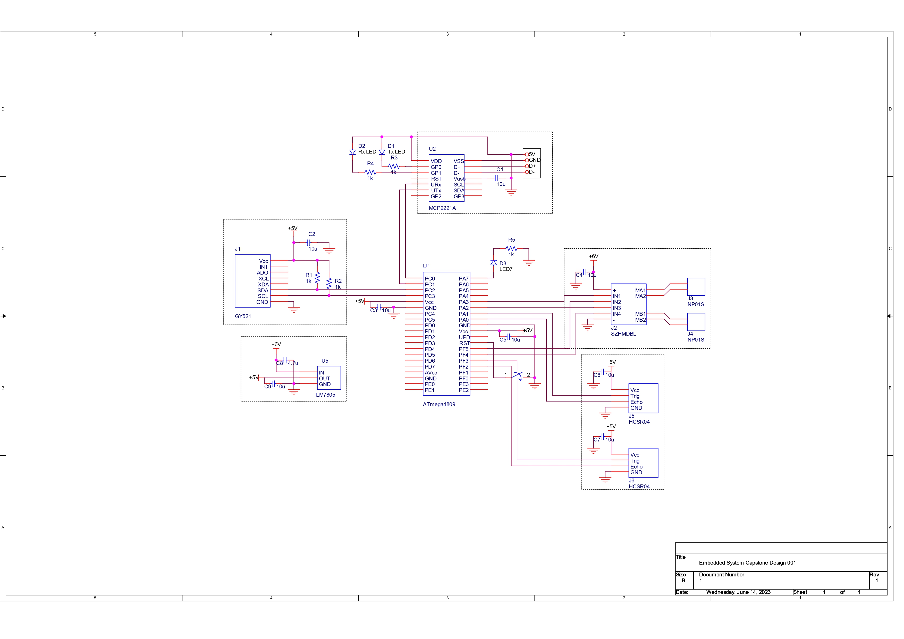
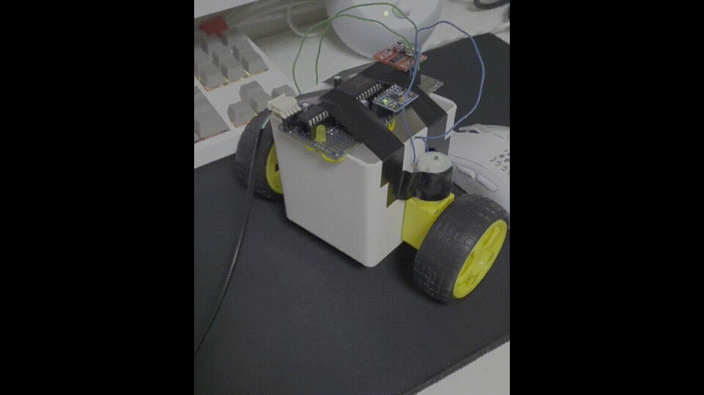

# ICE3015 project

> Inha Univ. Embedded System Capstone Design Final Project

## 실습 과제 (팀)

- [과제1](./homework/과제1_실습팀4.pdf)
- [과제2](./homework/과제2_실습팀4.pdf)
- [과제3](./homework/과제3_실습팀4.pdf)
- [과제4](./homework/과제4_실습팀4.pdf)

## 프로젝트 (개인)

### 프로젝트 예산

| 상품명 | 수량 | 금액(원) | 비고 |
| --- | --- | --- | --- |
| 기어박스 장착모터 NP01S-220	| 2 |	3,960 |	|
| 바퀴 66파이	| 2	| 1,760 | |	
| Dual DC 모터 드라이버 [SZH-MDBL-010] | 1 | 1,980 | |
| 자이로 가속도 센서 MPU-6050 [SZH-EK007] | 2 | 7,700 | 1개 파손 |
| 초음파 센서 HC-SR04 [SZH0USBC-004] | 2 | 3,960 | |	
| 만능기판 50*50 [SMEAPS55] | 1 | 1,870 | 파손 |
| 만능기판 97*90 | 1 | 3,300 | |
| 납땜용, 점프용 전선 (AWG24) 50mm | 1 | 3,410 | |	
| AA배터리 건전지 홀더 스위치형 [4개입] | 1 | 1,210 | |	
| 디바이스마트 배송비 | 3 | 8,100 | 부품 파손으로 인해 3회 주문 |

총 금액: 37,250원

MCU, 캐패시터, 레귤레이터 등의 일부 부품은 조교님께 제공받아 사용

### 부품 데이터시트

- [ATmega4808](./resource/datasheet/ATmega4808.pdf): MCU
- [MX1508](./resource/datasheet/MX1508.pdf): DC 모터 드라이버
- [MPU6050](./resource/datasheet/MPU6050.pdf): 자이로가속도 센서
- [HCSR04](./resource/datasheet/HCSR04.pdf): 초음파 센서

### 회로 설계

OrCAD를 이용해 회로 작성: [circuit.pdf](./esource/orcad/circuit.pdf)

### 테스트 코드

- [`test_arduino.ino`](./src/test_arduino.ino): 기본적인 회로 테스트 코드
- [`test_wire_mpu6050.ino`](./src/test_wire_mpu6050.ino): `Wire.h`를 이용한 MPU6050 센서 테스트 코드
- [`test_twi0_mpu6050.ino`](./src/test_twi0_mpu6050.ino): `TWI0` 레지스터를 이용한 MPU6050 센서 테스트 코드
- [`test_tca0_timer.ino`](./src/test_tca0_timer.ino): `TCA0` 레지스터를 이용한 타이머 테스트 코드
- [`test_tca0_hcsr04.ino`](./src/test_tca0_hcsr04.ino): `TCA0` 레지스터를 이용한 HC-SR04 센서 테스트 코드

### 프로젝트 결과

- [`mysegway.ino`](./src/mysegway.ino): 프로젝트 코드
- [`project.mp4`](./resource/video/project.gif): 프로젝트 데모

### 프로젝트 발표

- [프로젝트 제안서](./resource/project_proposal.pdf)
- [프로젝트 중간발표](./resource/project_interim.pdf)
- [프로젝트 최종발표](./resource/project_final.pdf)

### 프로젝트 연구일지

- [자이로가속도센서 브레드보드 조립](./resource/project_note_0512.pdf)
- [I2C를 이용한 자이로가속도 센서 값 인식](./resource/project_note_0518.pdf)
- [PWM 출력 이슈 해결](./resource/project_note_0524.pdf.pdf)
- [1차 밸런싱 로봇 조립](./resource/project_note_0527.pdf.pdf)
- [TCA0를 이용한 millis 구현](./resource/project_note_0604.pdf)
- [만능기판 납땜 진행](./resource/project_note_0609.pdf)
- [만능기판 납땜 완료](./resource/project_note_0612.pdf)
- [레귤레이터와 배터리 장착, 그리고 전원 불안정](./resource/project_note_0613.pdf)

### 프로젝트 관련 포스트

- [네모난 보드속에 피어난 How is the life? 아두이노 setup과 loop의 동작 원리](https://int-i.github.io/cpp/2023-03-17/arudino-setup-loop/)
- [흔들리는 센서 속에서 네 노이즈가 느껴진거야: MPU6050과 상보필터](https://int-i.github.io/cpp/2023-06-24/mpu6050-complementary-filter/)
- [나는 부름을 받았고, 응해야 하오... 언제든. 인터럽트와 ISR (with TCA)](https://int-i.github.io/cpp/2023-07-04/arduino-interrupt/)
